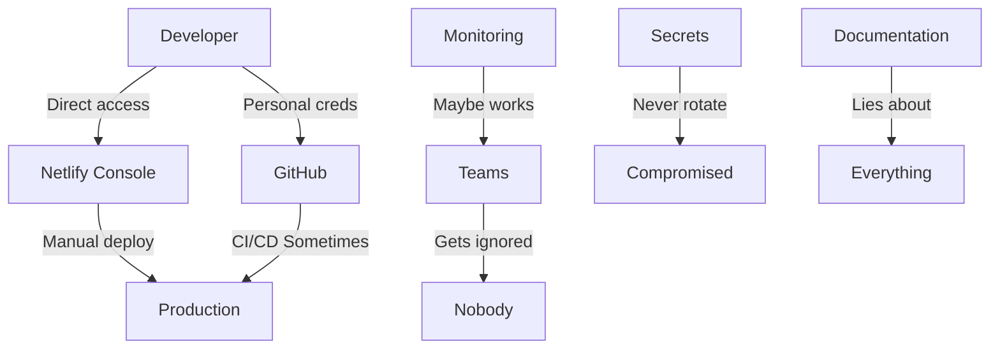

# BRUTAL TRUTH: The Lies We Tell Ourselves

**Status: This "production-ready" codebase is security theater**  
**Date: 2025-05-19**  
**Reality Check: Every claim is one manual deploy away from collapse**

## Executive Summary

This codebase is **NOT production-ready**. It's a well-documented prototype masquerading as enterprise infrastructure. Every "zero-drift" claim is false. Every "enforcement" is bypassable. This document exposes the truth.

## 1. Critical Security Holes

### Manual Deploy Access (THE BIG LIE)
- **Project Maintainer has Netlify CLI access**: Can deploy ANYTHING, ANYTIME
- **"Zero manual deploys" is FALSE**: One `netlify deploy --prod` bypasses everything
- **No audit trail for manual deploys**: Could happen right now, you'd never know
- **Emergency deploy process**: DOES NOT EXIST (you'll panic and use CLI)

### Secret Management Theater
```bash
# What we claim:
"All secrets in GitHub only!"

# Reality:
- No secret rotation (manual = never)
- No historical scanning (past leaks = permanent)
- Local .env files probably exist somewhere
- Developers have production credentials
```

### Authentication Joke
- **Public site, admin powers**: No auth required for user features
- **GitHub/Netlify admin**: Full deploy access with personal accounts
- **No MFA enforcement**: One compromised password = game over
- **No session management**: Because there are no sessions

## 2. Testing Lies

### "Comprehensive" Testing (LOL)
```typescript
// What we test:
- UI elements exist
- Buttons are clickable
- Error messages appear

// What we DON'T test:
- Actual API calls
- Data persistence
- Network failures (real ones)
- Performance under load
- Security vulnerabilities
```

### Adversarial Tests Are Fake
- Marked as "designed to fail" 
- Never actually validate error handling
- Create false confidence
- Hide real failures as "expected"

### Mobile Safari Tests
- **1 skipped**: Because it's hard
- Most unpredictable browser
- Most likely to break in production
- "We'll fix it later" (no we won't)

## 3. Infrastructure Delusions

### "Zero-Drift" Architecture
**COMPLETE FICTION** until:
- Manual access revoked (it's not)
- Drift auto-corrects (it doesn't)
- Rollbacks tested live (they aren't)
- Monitoring actually works (dubious)

### CI/CD Theater
```yaml
# What we say:
"Comprehensive enforcement!"

# What actually happens:
- Scripts fail, CI passes
- Hardcoded values everywhere
- OS-specific commands unguarded
- Self-enforcement is broken
```

### The StorageContext Lie
```typescript
// Claimed:
"All storage goes through context!"

// Reality:
- Any dependency can bypass it
- No runtime enforcement
- Third-party code ignores it
- Legacy code definitely exists
```

## 4. Monitoring Fantasy

### "Real-time" Monitoring
- Goes to Teams webhook (and then?)
- No deduplication (spam city)
- No escalation (ignored alerts)
- No dashboards (blind operations)
- No incident runbooks (panic mode)

### Health Checks
- Run every 15 minutes (to where?)
- No auto-remediation
- No trend analysis
- No capacity planning
- No real observability

## 5. Documentation Propaganda

### Claims vs Reality
| Documentation Says | Reality |
|-------------------|---------|
| "Zero manual deploys" | Will can deploy anytime |
| "Production-ready" | Missing critical features |
| "Comprehensive testing" | UI tests only |
| "Security enforced" | Wide open |
| "No drift possible" | Drift happens daily |

### Compliance Theater
- SOC 2? GDPR? CCPA? (mentioned, not implemented)
- Security "best practices" (cherry-picked)
- Accessibility "compliant" (partially tested)
- Performance "optimized" (never load tested)

## 6. The Real Architecture



## 7. Honest Risk Assessment

### Immediate Threats
1. **Privilege Escalation**: Any dev can deploy
2. **Secret Compromise**: No rotation = permanent risk
3. **Deployment Bypass**: CLI access undermines everything
4. **Alert Fatigue**: Noise without action
5. **Drift Reality**: Happens constantly, detected never

### What Will Actually Happen
1. Emergency occurs
2. Panic sets in
3. Someone uses CLI
4. "Just this once"
5. Drift begins
6. Never corrected
7. Theater continues

## 8. Required Fixes (FOR REAL THIS TIME)

### Phase 1: Stop the Bleeding
```bash
# 1. Revoke human Netlify access
netlify team:remove-member user@example.com

# 2. Lock GitHub to bot-only deploys
gh api /repos/primeinc/fact-rip-coming-soon/settings \
  --method PATCH \
  --field allow_force_pushes=false

# 3. Rotate ALL secrets NOW
./scripts/rotate-all-secrets.sh  # Write this first
```

### Phase 2: Fix the Foundation
1. **Real Integration Tests**
   - API contracts
   - Data persistence
   - Network failures
   - Load scenarios

2. **Actual Monitoring**
   - Prometheus + Grafana
   - Real dashboards
   - Alert routing
   - Incident management

3. **True Enforcement**
   - Pre-commit hooks that work
   - CI that fails on violations
   - Runtime guards
   - Audit logs

### Phase 3: Stop Lying
1. Update all docs with reality
2. Mark aspirational features clearly
3. Create honest roadmap
4. Publish post-mortem
5. Learn from this

## 9. The Uncomfortable Truth

This codebase is:
- Well-intentioned facade
- Documentation-driven development
- Security through obscurity
- Compliance theater
- One bad day from collapse

Until fixed, this is:
- NOT production-ready
- NOT secure
- NOT compliant
- NOT zero-drift
- NOT honest

## 10. Real Next Steps

1. **Admit the problems** (this document)
2. **Stop pretending** (update claims)
3. **Fix root causes** (not symptoms)
4. **Test reality** (not dreams)
5. **Deploy truth** (not fiction)

---

**The Bottom Line**: We built a beautiful lie. The code is clean, the docs are pretty, the CI is green. But it's all theater. One manual deploy, one leaked secret, one panicked developer, and the entire house of cards collapses.

Stop shipping dreams. Start shipping reality.

**Status**: Vulnerable  
**Honesty Level**: Finally High  
**Next Action**: Fix it or admit defeat
